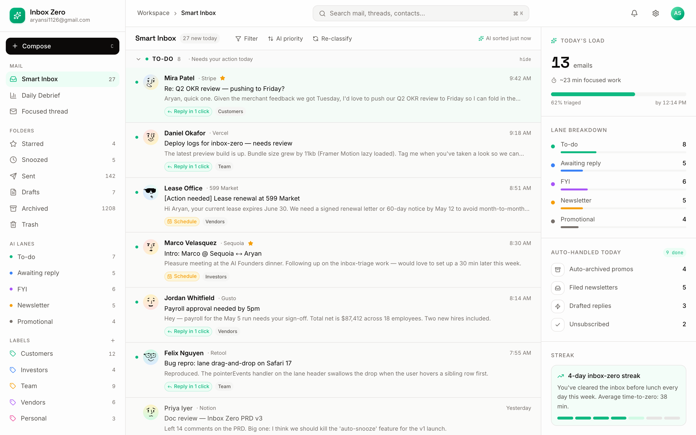
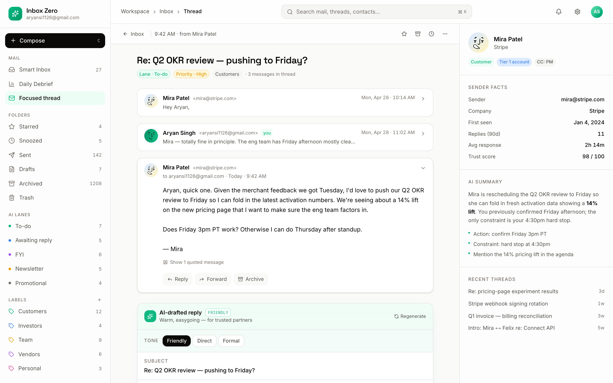
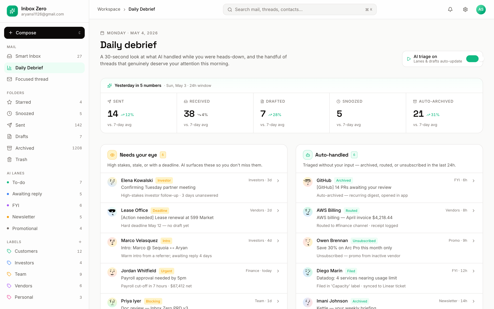

# Inbox Zero

> AI email triage that gets you to inbox zero by lunch.


A three-page email client MVP that classifies your inbox into priority lanes,
hands you a one-click drafted reply with citations, and shows a daily debrief
of everything triage handled while you were heads-down.

## Run locally

```bash
npm install
npm run dev   # http://localhost:3005
```

Production build:

```bash
npm run build
npm start
```

## Routes

| Path             | Description                                                                |
| ---------------- | -------------------------------------------------------------------------- |
| `/`              | Smart inbox — three-pane layout, AI lanes, suggested actions, today's load |
| `/email/[id]`    | Thread view — drafted reply, three tone presets, "why this reply" cites    |
| `/debrief`       | Daily debrief — yesterday's stats, needs-your-eye, auto-handled, trend     |

## Stack

- **Next.js 15** (App Router, static export of all 28 emails)
- **Tailwind CSS 4** with a hand-rolled token system (see `src/app/globals.css`)
- **Framer Motion** + **lucide-react**
- **next/font** — Inter, Space Grotesk, JetBrains Mono
- **DiceBear** notionists-neutral avatars (whitelisted via `next.config.ts`)

## Design tokens

| Token         | Value     |
| ------------- | --------- |
| `bg`          | `#fafaf9` |
| `bg-elev`     | `#ffffff` |
| `border`      | `#e7e5e4` |
| `text`        | `#0c0a09` |
| `text-mute`   | `#57534e` |
| `accent`      | `#10b981` |

Spacing 4–96, radii 6 / 10 / 16, motion 200–300ms with the standard
material easing curve.

## Screenshots

| Inbox | Detail | Debrief |
| --- | --- | --- |
|  |  |  |

## Project layout

```
src/
  app/
    page.tsx              # /
    email/[id]/page.tsx   # /email/[id]
    debrief/page.tsx      # /debrief
    layout.tsx
    globals.css
  components/
    Shell.tsx             # sidebar + topbar
    InboxView.tsx
    ThreadView.tsx
    DebriefView.tsx
    Avatar.tsx
  data/
    people.ts             # 27 contacts
    emails.ts             # 28 emails across 5 lanes
    threads.ts            # focal thread (3 messages)
    draft.ts              # 3 alternative-tone drafts + citations
    debrief.ts            # stats + needs-eye + auto-handled + 7-day trend
```
